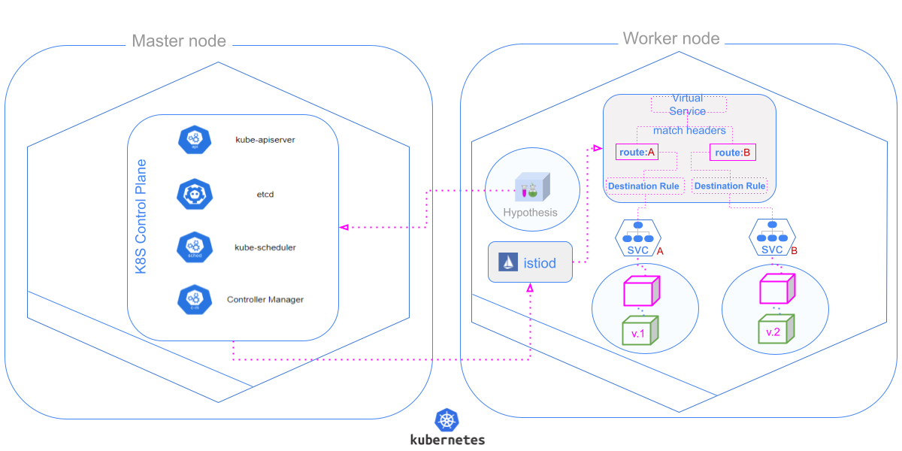

# 
# Welcome to Hypothesis

Hypothesis is an open source tool to ease the management of A/B tests using [Istio](https://istio.io/).

## Want to get Hypothesis?
- [Docker Hub](https://hub.docker.com/repository/docker/leviditomazzo/hypothesis/tags) for Docker images.
- [GitHub releases](https://github.com/levidi/hypothesis/releases) for releases and changelogs.

## How does Hypothesis work?

Hypothesis provides a high level configuration about the objects needed to create the A/B Test, just informing the deployment and corresponding service, Hypothesis will create a copy of these objects replacing only the image name of the deployment and automatically create the VirtualService accordingly with the corresponding settings you provide.



## How to install

- For the latest version use this command

```bash
kubectl apply -f https://raw.githubusercontent.com/levidi/hypothesis/releases/latest/example/core/install.yaml
```

- For a especific tagged release replace <ta_version> and use this command

```bash
kubectl apply -f https://raw.githubusercontent.com/levidi/hypothesis/releases/latest/<tag_version>example/core/install.yaml
```
